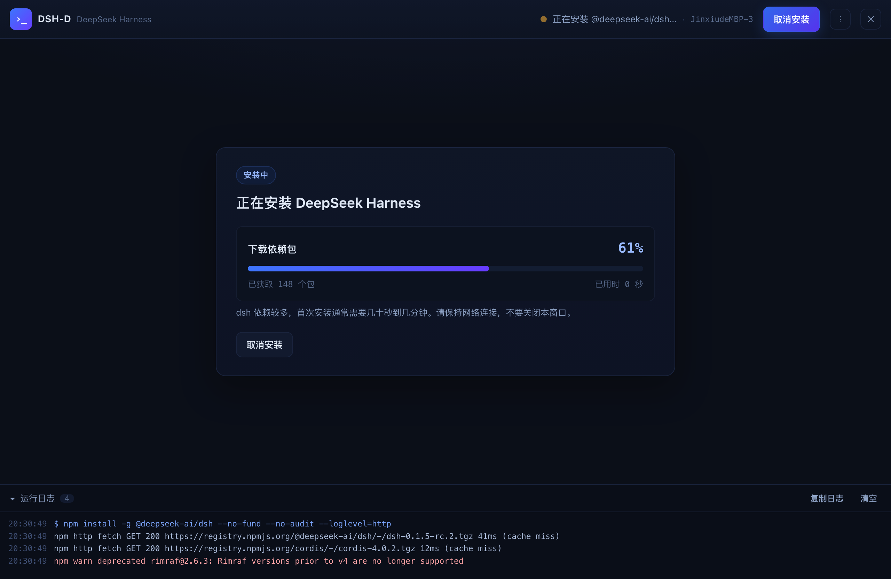
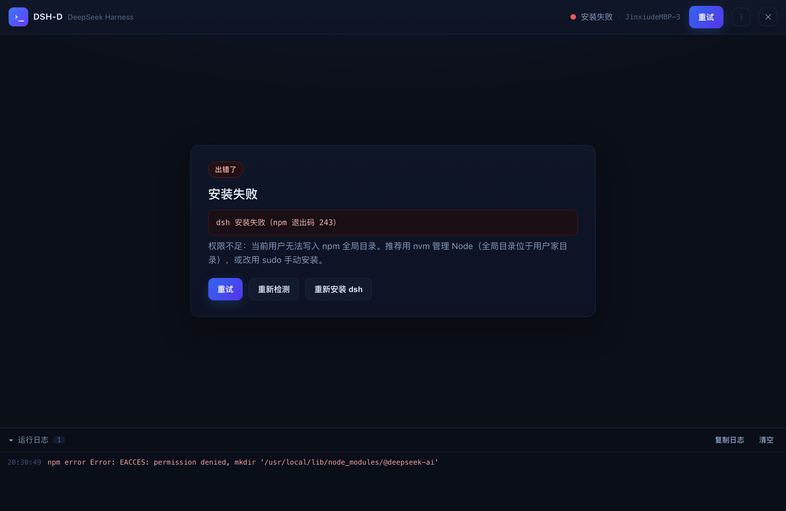
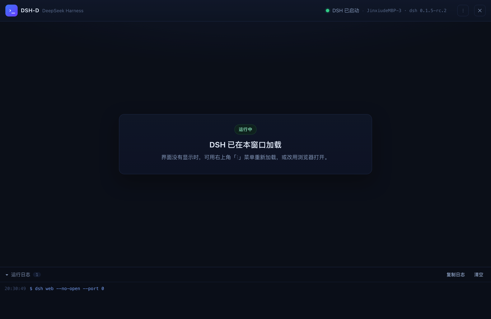
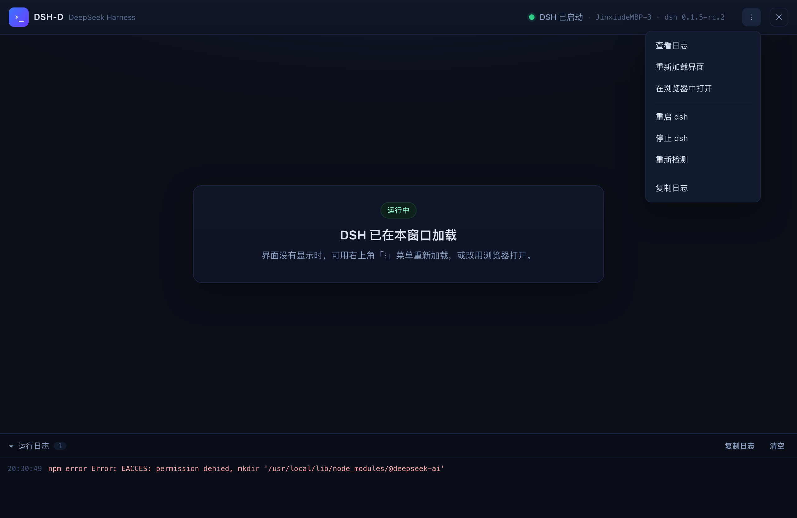

# DSH-D

一个 Electron 桌面外壳：**检测 → 安装 → 启动 → 加载** [DeepSeek Harness](https://github.com/deepseek-ai/deepseek-harness)（`dsh`）。

启动应用后：

1. **检测**：自动解析登录 shell 环境（nvm / Homebrew / volta 装的 `node`、`npm`、`dsh` 在 GUI 应用里默认不可见，本项目会主动找回），并检测 `node`、`npm`、`dsh` 是否可用。
2. **安装提示**：若未检测到 `dsh`，界面展示安装卡片与将要执行的命令，点击「安装 dsh」即执行 `npm install -g @deepseek-ai/dsh`，并**实时显示进度**（阶段 + 百分比 + 已获取包数 + 耗时 + 完整日志，可取消）。
3. **启动**：安装完成后自动重新检测，并启动 `dsh web --no-open`。
4. **加载**：解析 dsh 打印的带鉴权 token 的地址，在窗口内嵌的 `WebContentsView` 中加载运行中的 dsh 界面。

工具栏只保留当前阶段的主操作（安装 / 取消 / 停止 / 重试），**重新加载、查看日志、浏览器打开、重启/停止 dsh、重新检测等调试与维护操作都收在右上角的「⋮」菜单里**；状态区显示当前状态 + 机器名 + dsh 版本（端口仅在内部使用，不占用界面）。退出应用时会一并结束 dsh 子进程。

## 快速开始

```bash
npm install          # 安装 electron 与 electron-builder
npm start            # 开发运行
```

打包成可直接在桌面运行的安装包（**可在 macOS 上交叉构建 Windows 客户端，无需 Wine**）：

```bash
npm run dist         # 当前平台，输出到 release/
npm run dist:mac     # macOS: dmg + zip（未签名，本机可直接运行）
npm run dist:win     # Windows: NSIS 安装包 + 免安装 zip（在 macOS/Linux 上同样可用）
npm run dist:linux   # Linux: AppImage + deb
npm run pack         # 只产出当前平台的应用目录（最快，双击即可运行）
```

网络受限时（GitHub Releases 不可达）交叉构建 Windows 的完整命令：

```bash
ELECTRON_MIRROR=https://registry.npmmirror.com/-/binary/electron/ \
ELECTRON_BUILDER_BINARIES_MIRROR=https://registry.npmmirror.com/-/binary/electron-builder-binaries/ \
npx electron-builder --win
```

产物：

| 文件 | 说明 |
| --- | --- |
| `release/mac/DSH-D.app` | macOS 应用包，双击运行 |
| `release/DSH-D-0.1.0-mac.zip` | macOS 压缩分发版（解压即用） |
| `release/DSH-D-0.1.0.dmg` | macOS 拖拽安装镜像 |
| `release/DSH-D Setup 0.1.0.exe` | Windows 安装包（NSIS，可选安装目录、创建桌面快捷方式） |
| `release/DSH-D-0.1.0-win.zip` | Windows 免安装压缩版（解压后运行 `DSH-D.exe`） |
| `release/win-unpacked/` | Windows 免安装目录（打包中间产物，可直接运行） |
| `release/*.AppImage` / `*.deb` | Linux 对应产物 |

> **DMG 需要联网下载工具**：electron-builder 的 `dmg` 目标会从 GitHub Releases 下载 `dmgbuild` 工具包，无法访问 GitHub 时会失败（`.app` 与 `.zip` 已在失败前生成，可直接使用）。离线替代方案：
> ```bash
> npm run pack && ./scripts/make-dmg.sh
> ```
>
> 应用图标已预先构建为 `assets/icon.icns`（macOS）与 `assets/icon.ico`（Windows），打包因此不再需要从 GitHub 下载 electron-builder 的图标工具；修改 `assets/icon.png` 后重新生成即可：`./scripts/make-icns.sh` 与 `node scripts/make-ico.mjs`。
>
> **Apple Silicon**：默认构建当前架构；交叉构建用 `npx electron-builder --mac --arm64`。`identity: null` 表示不签名，Intel 机器可直接运行；在 M 系列机器上分发时建议至少做临时签名 `codesign --force --deep --sign - "release/mac/DSH-D.app"`，或配置 Apple Developer 证书并公证。
>
> macOS 构建为未签名版本（`electron-builder.yml` 中 `mac.identity: null`）。首次打开若被 Gatekeeper 拦截，右键「打开」或在「系统设置 → 隐私与安全性」中允许即可。要分发给他人，请配置 Apple Developer 证书与公证。
>
> **Electron 版本**：固定为 `^43`。Electron 44 起已移除 macOS 12（Monterey）支持，43 是最后一个可在 Monterey 上运行的版本；若你的机器是 macOS 13+ 或 Windows/Linux，可自行升级到最新版。
>
> 如果 `npm install` 卡在下载 Electron 二进制（网络无法访问 GitHub Releases），可使用镜像：
> ```bash
> ELECTRON_MIRROR=https://registry.npmmirror.com/-/binary/electron/ npm install
> ```
> npm 11.16+ 若提示安装脚本未授权（Electron 二进制未下载），执行 `npm approve-scripts electron electron-winstaller` 后重新 `npm install`，或手动补跑：`cd node_modules/electron && node install.js`。

## 界面预览

工具栏只放当前阶段的主操作，调试类操作统一收进右上角「⋮」菜单：

| 检测中 | 未安装（安装提示） |
| --- | --- |
|  |  |

| 安装中（进度 + 实时日志） | 运行时出错 |
| --- | --- |
|  |  |

运行中：顶部工具栏显示 `DSH 已启动 · 机器名 · dsh 版本`，右侧「⋮」菜单包含「返回 DSH 界面 / 查看日志、重新加载界面、在浏览器中打开、重启 dsh、停止 dsh、重新检测、复制日志」，工具栏下方即内嵌的运行中 dsh 界面（选「查看日志」会临时隐藏界面，方便查看日志）。



「⋮」菜单（运行中）：查看日志 / 重新加载界面 / 在浏览器中打开 / 重启 dsh / 停止 dsh / 重新检测 / 复制日志。



> 预览图由 `npm run capture-ui` 生成（`--capture-ui`，用合成状态渲染各阶段后截图，不会启动 dsh）。

## 脚本

| 命令 | 作用 |
| --- | --- |
| `npm start` | 启动桌面应用 |
| `npm run dev` | 启动并打开开发者工具 |
| `npm test` / `npm run verify` | 纯 Node 逻辑验证（检测、进度模型、安装流程、服务生命周期、状态机端到端） |
| `npm run self-test` | Electron 运行时冒烟测试：窗口、preload 桥、界面、内嵌视图、IPC；**不会启动 dsh** |
| `npm run capture-ui` | 把各阶段界面渲染成 `ui-preview/*.png`（含打开的 ⋮ 菜单） |
| `npm run pack` / `npm run dist` | 打包桌面应用 |

## 目录结构

```
src/main/
  main.js          Electron 主进程：窗口、IPC、内嵌 dsh 界面视图、退出时清理
  controller.js    状态机：checking → missing-dsh → installing → starting → running
  shell-env.js     登录 shell 环境解析（找回 GUI 应用缺失的 PATH）
  dsh-detect.js    node / npm / dsh 检测与版本解析
  dsh-install.js   npm 全局安装，流式输出与失败诊断
  progress.js      npm 输出 → 进度模型
  dsh-server.js    dsh web 进程监管 + 带 token 地址解析
  process-tree.js  子进程终止与行缓冲
  preload.js       contextBridge 安全桥（渲染进程仅能调用白名单方法）
src/renderer/      界面：检测 / 安装提示 / 进度 / 启动 / 运行 / 错误面板 + 日志面板
test/              验证脚本与 fixture（伪 npm、伪 dsh）
```

## 设计要点

- **GUI 应用的 PATH 问题**：从 Finder/Dock 启动的应用不继承登录 shell 环境。`shell-env.js` 通过 `<shell> -ilc 'printf %s "$PATH"'` 取回真实 PATH，再补充 nvm/Homebrew/volta/pnpm 等常见目录与 `npm prefix -g` 推出的全局 bin 目录。
- **进度从哪来**：`npm install -g` 在非 TTY 下不打印进度条，因此以 `--loglevel=http` 运行，按 `http fetch` 行数渐进推进（渐近曲线，上限 78%），再用 `reify` / `added N packages` 行收尾到 100%。百分比单调递增，不会倒退。
- **为什么要等一行日志**：`dsh web` 打印的地址带有本次进程的 token（`?token=…`，用于换取浏览器 cookie）。只有等待 `dsh web: <url>` 这一行，才能把可用的界面地址交给内嵌视图；因此用 `--port 0` 让系统分配空闲端口，避免端口占用类失败。
- **进程生命周期**：安装与 dsh 服务都是子进程，退出应用时先 `SIGTERM`、超时后 `SIGKILL`（Windows 用 `taskkill /T`），避免残留进程占住端口；`dispose()` 是异步的，所以首个 `before-quit` 会被延后到清理完成。
- **重启竞态**：旧实例的退出事件不会覆盖新实例的状态（控制器只接受"当前实例"的事件）。
- **Windows 上的 `.cmd`**：npm 与 dsh 在 Windows 上都是 `.cmd` 垫片，而 Node 18.20+/20.12+ 起不允许无 shell 直接 spawn `.cmd`/`.bat`，因此探测与启动都显式走 `cmd.exe`，并对 `C:\Program Files\...` 这类含空格的路径加引号（`shellCommandFor`）。
- **安全边界**：渲染进程 `sandbox` + `contextIsolation`，无 Node 集成，仅暴露白名单 IPC；dsh 界面同样是沙箱化视图，外链一律交给系统浏览器；界面有 CSP。

## 环境变量

| 变量 | 说明 |
| --- | --- |
| `DSH_D_PORT` | 固定 dsh web 端口（默认 `0`，由系统分配空闲端口） |
| `DSH_D_USER_DATA` | 覆盖 Electron 用户数据目录（便携 / 测试用） |

## 已验证内容

`npm test`（68 项）覆盖：登录环境解析、检测、进度模型、`dsh web: <url>` 解析、安装成功/失败与提示、服务启停生命周期、状态机端到端（未安装 → 安装 → 启动 → 运行 → 重启 → 停止，使用 fixture 注入，不触碰真实 npm/dsh），以及**模拟 `win32` 的 Windows 代码路径**（`.cmd` 是否走 shell、含空格路径的引号处理、PATH 分号分隔、PATHEXT 解析、Windows 全局目录推断）。

`npm run self-test`（18 项）在真实 Electron 中验证：窗口与界面渲染、preload 桥、IPC 往返、剪贴板 API、主进程检测、`WebContentsView` 创建/尺寸/隐藏，以及工具栏（菜单可展开、不遮挡退出按钮、运行阶段无内联调试按钮、状态区显示机器名与 dsh 版本且不含端口）。

> 在受限环境（容器、外层的进程沙箱、CI）中，Chromium 自身的沙箱可能无法初始化，此时可加 `--no-sandbox --disable-gpu` 运行自检：
> ```bash
> npx electron . --self-test --no-sandbox --disable-gpu
> ```
> 正常桌面环境直接 `npm run self-test` 即可。

## 许可

MIT
