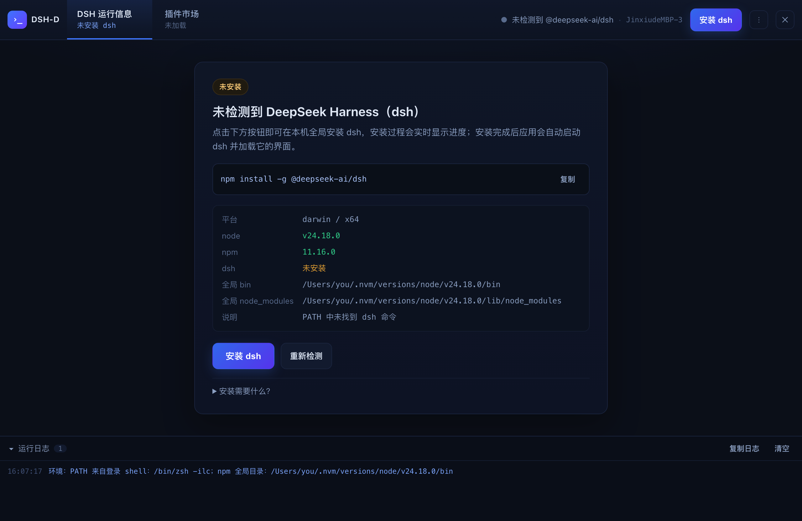
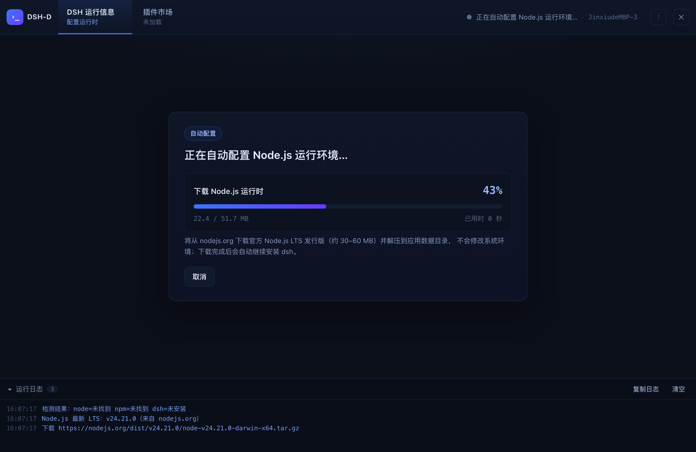
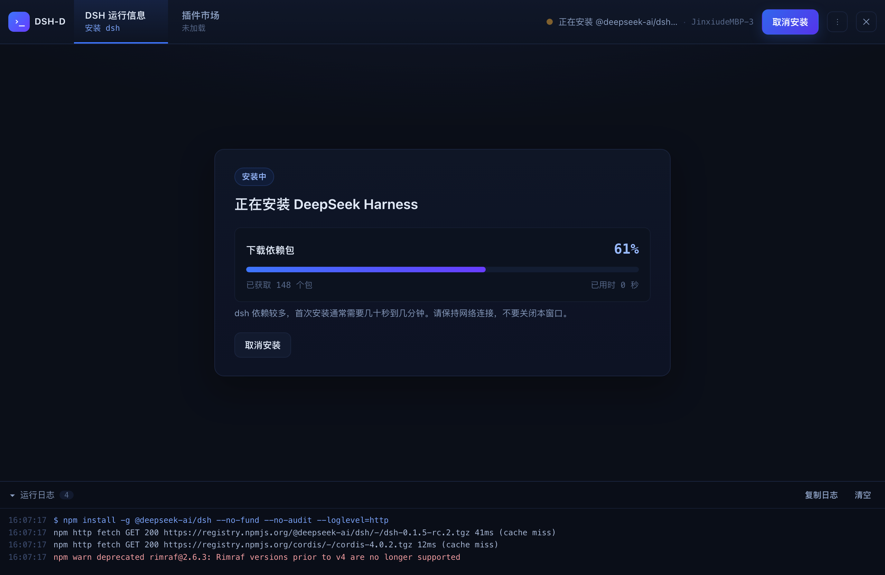
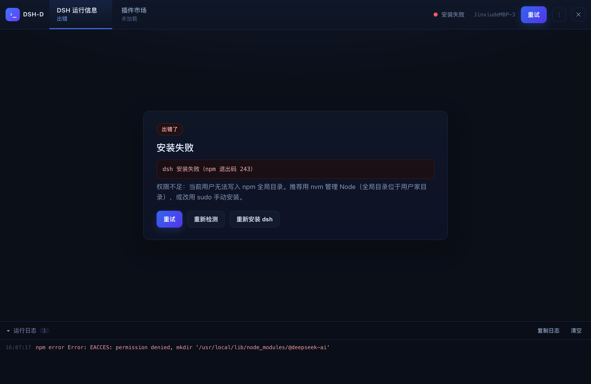
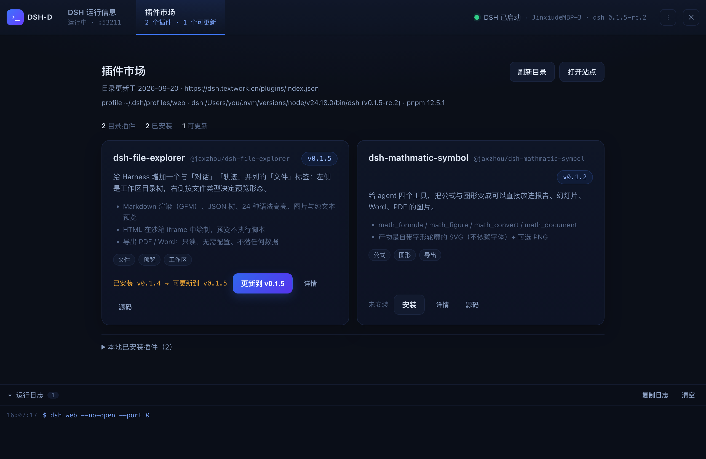
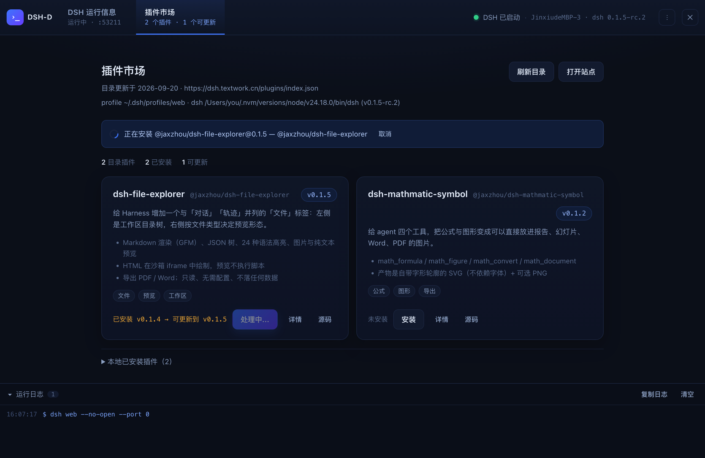
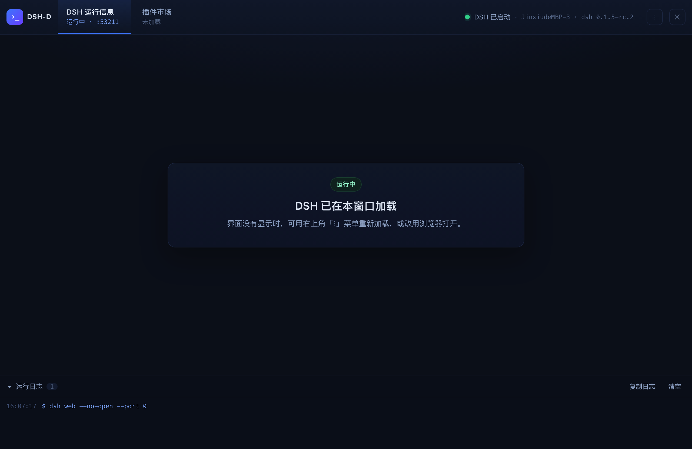
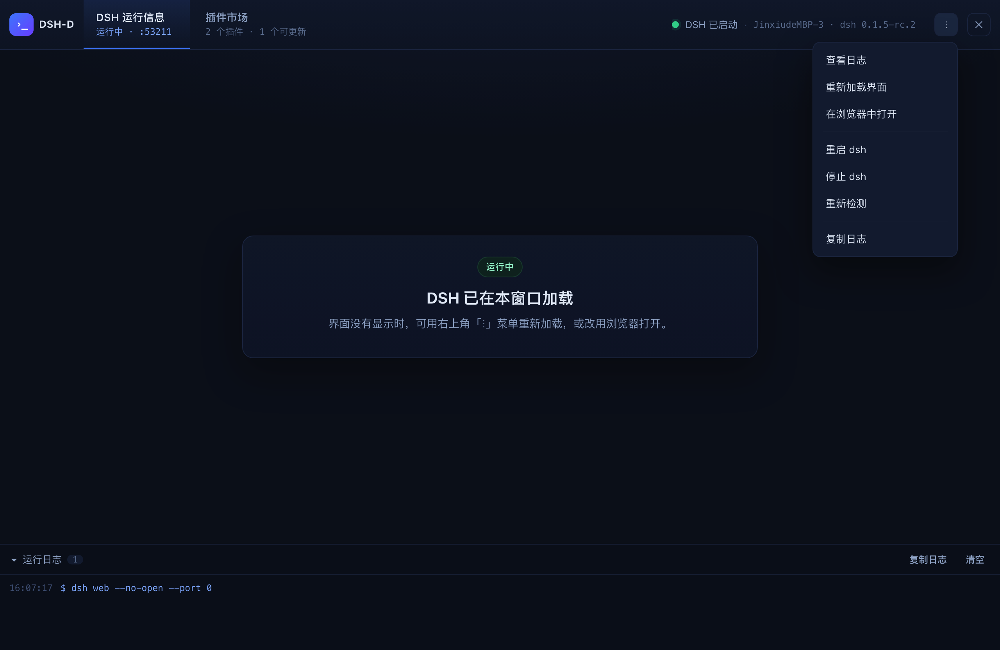

# DSH-D

一个 Electron 桌面外壳：**检测 → 安装 → 启动 → 加载** [DeepSeek Harness](https://github.com/deepseek-ai/deepseek-harness)（`dsh`）。

启动应用后：

0. **自动配置运行环境**：如果本机没有 Node.js、没有 npm，或 Node 低于 dsh 需要的 v22（dsh 依赖用到 `Promise.withResolvers`），应用会**自动下载官方 Node.js LTS 发行版**并解压到自己的数据目录，随后 dsh 也安装在同一个目录内——**无需管理员权限，也不改动系统已有环境**；下载与解压过程都有进度、可取消。**pnpm 与 Node/npm 一样纳入启动检查**：插件市场通过 `dsh plugin` 安装插件，而它本质是 pnpm 转发器，所以启动时若发现 pnpm 缺失会自动用当前 npm 装到同一运行时而无需管理员权限（失败不阻塞 dsh 运行，市场页会给出告警与一键重试）。
1. **检测**：自动解析登录 shell 环境（nvm / Homebrew / volta 装的 `node`、`npm`、`dsh` 在 GUI 应用里默认不可见，本项目会主动找回），并检测 `node`、`npm`、`dsh` 是否可用。
2. **安装提示**：若未检测到 `dsh`，界面展示安装卡片与将要执行的命令，点击「安装 dsh」即执行 `npm install -g @deepseek-ai/dsh`，并**实时显示进度**（阶段 + 百分比 + 已获取包数 + 耗时 + 完整日志，可取消）。
3. **启动**：安装完成后自动重新检测，并启动 `dsh web --no-open`。
4. **加载**：解析 dsh 打印的带鉴权 token 的地址，在窗口内嵌的 `WebContentsView` 中加载运行中的 dsh 界面。

### 顶部大 tab

两个大 tab 与品牌、状态、操作同在**顶栏一行内**（不另起一行）；内嵌的 dsh 界面从顶栏下方开始。

| tab | 内容 |
| --- | --- |
| **DSH 运行信息** | 运行中的 dsh Web 界面（内嵌 `WebContentsView`）；未就绪时显示检测/安装/启动各阶段面板 |
| **插件市场** | 外壳自带的插件市场（独立于 dsh，不是 dsh 插件）：读取 `dsh.textwork.cn` 上的目录，展示版本、本地已安装版本与可更新项，可一键安装/更新；安装完成后自动重启 dsh 并刷新 DSH tab 的 Web 界面 |

插件市场的数据来源是 <https://dsh.textwork.cn/plugins/index.json>（仓库内为 `site/plugins/index.json`，随站点发布）；默认管理 dsh 的 `web` profile。

工具栏只保留当前阶段的主操作（安装 / 取消 / 停止 / 重试），**重新加载、查看日志、浏览器打开、重启/停止 dsh、重新检测等调试与维护操作都收在右上角的「⋮」菜单里**；状态区显示当前状态 + 机器名 + dsh 版本（端口仅在内部使用，不占用界面）。退出应用时会一并结束 dsh 子进程。

> 现成安装包发布在 **<https://dsh.textwork.cn>**（Windows / macOS / Linux），
> 校验清单：<https://dsh.textwork.cn/download/SHA256SUMS>

## 快速开始

```bash
npm install          # 安装 electron 与 electron-builder
npm start            # 开发运行
```

打包成可直接在桌面运行的安装包（**可在 macOS 上交叉构建 Windows 客户端，无需 Wine**）：

```bash
npm run dist         # 当前平台，输出到 release/
npm run dist:mac     # macOS: dmg + zip（未签名，本机可直接运行）
npm run dist:win     # Windows: NSIS 安装包 + 免安装 zip（在 macOS/Linux 上同样可用）
npm run dist:linux   # Linux: AppImage + deb + tar.gz（在 macOS 上交叉构建同样可用）
npm run pack         # 只产出当前平台的应用目录（最快，双击即可运行）
```

网络受限时（GitHub Releases 不可达）交叉构建 Windows 的完整命令：

```bash
ELECTRON_MIRROR=https://registry.npmmirror.com/-/binary/electron/ \
ELECTRON_BUILDER_BINARIES_MIRROR=https://registry.npmmirror.com/-/binary/electron-builder-binaries/ \
npx electron-builder --win
```

产物：

| 文件 | 说明 |
| --- | --- |
| `release/mac/DSH-D.app` | macOS 应用包，双击运行 |
| `release/DSH-D-0.1.2-mac.zip` | macOS 压缩分发版（解压即用） |
| `release/DSH-D-0.1.2.dmg` | macOS 拖拽安装镜像 |
| `release/DSH-D-Setup-0.1.2.exe` | Windows 安装包（NSIS，可选安装目录、创建桌面快捷方式） |
| `release/DSH-D-0.1.2-win.zip` | Windows 免安装压缩版（解压后运行 `DSH-D.exe`） |
| `release/win-unpacked/` | Windows 免安装目录（打包中间产物，可直接运行） |
| `release/DSH-D-0.1.2.AppImage` | Linux 免安装单文件（chmod +x 后直接运行） |
| `release/dsh-d_0.1.2_amd64.deb` | Debian/Ubuntu 安装包（自动创建 `/usr/bin/dsh-d` 与桌面项） |
| `release/dsh-d-0.1.2.tar.gz` | Linux 免安装压缩版 |

> **DMG 需要联网下载工具**：electron-builder 的 `dmg` 目标会从 GitHub Releases 下载 `dmgbuild` 工具包，无法访问 GitHub 时会失败（`.app` 与 `.zip` 已在失败前生成，可直接使用）。离线替代方案：
> ```bash
> npm run pack && ./scripts/make-dmg.sh
> ```
>
> 应用图标已预先构建好三平台所需格式——`assets/icon.icns`（macOS）、`assets/icon.ico`（Windows）、`assets/icons/*.png`（Linux 尺寸集），打包因此不再需要从 GitHub 下载 electron-builder 的图标工具；修改 `assets/icon.png` 后重新生成即可：`node scripts/make-icons.mjs`。
>
> **Linux 的 deb 与 macOS 的 GNU tar**：electron-builder 用 fpm 打包 deb，而 fpm 会用 GNU tar 的 `--owner=0 --group=0` 归档，macOS 自带的 bsdtar 不支持这两个选项（`Option --owner=0 is not supported`），deb 会直接失败。`npm run dist:linux` 在 macOS 上检测不到 GNU tar 时会自动把 `scripts/gtar-shim` 放到 PATH 最前——这是一个把 GNU 选项翻译成 bsdtar 等价的薄垫片（仅用于打包，不进入产物）。装了 `brew install gnu-tar` 后就不再需要它。
>
> **Apple Silicon**：默认构建当前架构；交叉构建用 `npx electron-builder --mac --arm64`。`identity: null` 表示不签名，Intel 机器可直接运行；在 M 系列机器上分发时建议至少做临时签名 `codesign --force --deep --sign - "release/mac/DSH-D.app"`，或配置 Apple Developer 证书并公证。
>
> macOS 构建为未签名版本（`electron-builder.yml` 中 `mac.identity: null`）。首次打开若被 Gatekeeper 拦截，右键「打开」或在「系统设置 → 隐私与安全性」中允许即可。要分发给他人，请配置 Apple Developer 证书与公证。
>
> **Electron 版本**：固定为 `^43`。Electron 44 起已移除 macOS 12（Monterey）支持，43 是最后一个可在 Monterey 上运行的版本；若你的机器是 macOS 13+ 或 Windows/Linux，可自行升级到最新版。
>
> 如果 `npm install` 卡在下载 Electron 二进制（网络无法访问 GitHub Releases），可使用镜像：
> ```bash
> ELECTRON_MIRROR=https://registry.npmmirror.com/-/binary/electron/ npm install
> ```
> npm 11.16+ 若提示安装脚本未授权（Electron 二进制未下载），执行 `npm approve-scripts electron electron-winstaller` 后重新 `npm install`，或手动补跑：`cd node_modules/electron && node install.js`。

## 界面预览

工具栏只放当前阶段的主操作，调试类操作统一收进右上角「⋮」菜单：

| 检测中 | 未安装（安装提示） |
| --- | --- |
|  |  |

| 自动配置 Node.js 运行时 | 安装 dsh（进度 + 实时日志） |
| --- | --- |
|  |  |

| 运行中出错 | 插件市场 |
| --- | --- |
|  |  |

插件市场支持安装/更新，过程有进度与取消，完成后自动重启 dsh 并刷新 DSH 界面：



运行中：顶部工具栏显示 `DSH 已启动 · 机器名 · dsh 版本`，右侧「⋮」菜单包含「返回 DSH 界面 / 查看日志、重新加载界面、在浏览器中打开、重启 dsh、停止 dsh、重新检测、复制日志」，工具栏下方即内嵌的运行中 dsh 界面（选「查看日志」会临时隐藏界面，方便查看日志）。



「⋮」菜单（运行中）：查看日志 / 重新加载界面 / 在浏览器中打开 / 重启 dsh / 停止 dsh / 重新检测 / 复制日志。



> 预览图由 `npm run capture-ui` 生成（`--capture-ui`，用合成状态渲染各阶段后截图，不会启动 dsh）。

## 脚本

| 命令 | 作用 |
| --- | --- |
| `npm start` | 启动桌面应用 |
| `npm run dev` | 启动并打开开发者工具 |
| `npm test` / `npm run verify` | 纯 Node 逻辑验证（检测、进度模型、安装流程、服务生命周期、状态机端到端） |
| `npm run self-test` | Electron 运行时冒烟测试：窗口、preload 桥、界面、内嵌视图、工具栏、IPC；**不会启动 dsh** |
| `npm run test:network` | 实网验证运行时自动配置：真实下载 Node.js LTS、确认 npm 全局目录落在托管目录内、真实安装一次 dsh |
| `npm run diagnose` | 运行时配置诊断：模拟一台没有 Node 的机器跑完整流程，逐条打印 node/npm 检查结果（排查环境问题用） |
| `npm run capture-ui` | 把各阶段界面渲染成 `ui-preview/*.png`（含打开的 ⋮ 菜单） |
| `npm run pack` / `npm run dist` | 打包桌面应用 |

## 目录结构

```
src/main/
  main.js          Electron 主进程：窗口、IPC、内嵌 dsh 界面视图、退出时清理
  controller.js    状态机：checking → missing-dsh → installing → starting → running
  shell-env.js     登录 shell 环境解析（找回 GUI 应用缺失的 PATH）
  dsh-detect.js    node / npm / dsh 检测与版本解析
  dsh-install.js   npm 全局安装，流式输出与失败诊断
  progress.js      npm 输出 → 进度模型
  dsh-server.js    dsh web 进程监管 + 带 token 地址解析
  plugin-market.js 插件市场：目录抓取/校验、已装插件扫描、pnpm 自举、安装命令
  process-tree.js  子进程终止与行缓冲
  preload.js       contextBridge 安全桥（渲染进程仅能调用白名单方法）
src/renderer/      界面：顶部大 tab（DSH 运行信息 / 插件市场）+ 阶段面板 + 日志面板
site/plugins/      站点侧内容（插件市场目录 index.json，随 dsh.textwork.cn 发布）
test/              验证脚本与 fixture（伪 npm、伪 dsh）
```

## 设计要点

- **GUI 应用的 PATH 问题**：从 Finder/Dock 启动的应用不继承登录 shell 环境。`shell-env.js` 通过 `<shell> -ilc 'printf %s "$PATH"'` 取回真实 PATH，再补充 nvm/Homebrew/volta/pnpm 等常见目录与 `npm prefix -g` 推出的全局 bin 目录。
- **进度从哪来**：`npm install -g` 在非 TTY 下不打印进度条，因此以 `--loglevel=http` 运行，按 `http fetch` 行数渐进推进（渐近曲线，上限 78%），再用 `reify` / `added N packages` 行收尾到 100%。百分比单调递增，不会倒退。
- **为什么要等一行日志**：`dsh web` 打印的地址带有本次进程的 token（`?token=…`，用于换取浏览器 cookie）。只有等待 `dsh web: <url>` 这一行，才能把可用的界面地址交给内嵌视图；因此用 `--port 0` 让系统分配空闲端口，避免端口占用类失败。
- **进程生命周期**：安装与 dsh 服务都是子进程，退出应用时先 `SIGTERM`、超时后 `SIGKILL`（Windows 用 `taskkill /T`），避免残留进程占住端口；`dispose()` 是异步的，所以首个 `before-quit` 会被延后到清理完成。
- **重启竞态**：旧实例的退出事件不会覆盖新实例的状态（控制器只接受"当前实例"的事件）。
- **运行环境自举**：dsh 的依赖用到 `Promise.withResolvers`（Node 22+），所以"没有 Node"也包括"Node 太旧"。缺失时下载官方发行版到 `<userData>/runtime/node-<版本>-<平台>-<架构>`，校验 `node --version` 可用后才交给后续流程；已下载的安装包与已解压的运行时都会复用，重试不会重复下载。
- **posix 上 npm 依赖 PATH 找到 node**：`bin/npm` 是指向 `npm-cli.js` 的符号链接，该脚本 shebang 为 `#!/usr/bin/env node`——因此执行 npm 需要 PATH 里先有 node。校验运行时（`verifyManagedRuntime`）会强制把托管 bin 目录置于 PATH 最前，而不是沿用调用方环境；否则在"本来就没有 node"的机器上，node 能装好但 npm 一定失败，从而陷入反复重配的死循环。
- **坏运行时不会被困在循环里**：只检查文件是否存在是不够的（半解压的运行时 node 能跑、npm 不能），复用前必须真实执行 node 与 npm；校验失败就删除目录重新配置，并在界面上说明是 node 还是 npm 失败、具体报错是什么。
- **为什么必须锁定 npm 的 prefix**：npm 的全局目录来自启动环境——父级 `npm run` 会导出 `npm_config_global_prefix`，用户 `~/.npmrc` 也可能写了 `prefix`，两者都会让 `npm install -g` 落到需要管理员权限的系统目录。因此托管运行时会把 `npm_config_prefix` 与 `npm_config_cache` 钉在托管目录内（registry/代理等其余配置保持不变），这也是实网验证里专门校验的一项。
- **插件装到"实际在跑的 dsh"上**：dsh 的 home 由 `$DSH_HOME`（支持 `~` 展开）或 `os.homedir()/.dsh` 决定，而 `os.homedir()` 在 Windows 读的是 `USERPROFILE`/`HOMEDRIVE`+`HOMEPATH`。市场因此**按传给 dsh 的那个环境**解析 home 与 `profiles/<profile>`（而不是想当然用 `~/.dsh`），并且始终用检测到的那个 dsh 执行命令——这样当 dsh 是 DSH-D 私有安装的（Windows 上常见，`<userData>/runtime/node-*/dsh.cmd`）、或机器把 `DSH_HOME` 指到别处时，读取的已装版本与安装目标都仍然正确。市场页顶部始终显示 `profile 目录 · dsh 路径(版本) · pnpm 状态`，profile 缺失时会列出该 home 下实际存在的 profile。
- **插件市场为什么这样工作**：市场是外壳自身的能力（不是 dsh 插件）；它管理的是 **dsh 插件**，因为只有装进 dsh profile 的插件才会影响 Harness 本身。`dsh plugin` 本质是 pnpm 转发器——在 profile 目录里 `pnpm add`，随后把 `dsh.profile.bundles` 与已安装状态对齐，而 **bundle 只在启动时读取**，所以安装/更新成功后必须重启 dsh，这次重启同时也是"刷新 DSH tab 里 dsh Web"的动作。已安装的版本来自 `<profile>/node_modules/<pkg>/package.json`，`link:`/`file:` 等本地依赖会被标注出来。
- **外部输入不直接进命令行**：目录是远端数据，包名与版本都要先通过白名单正则（`@scope/name`、semver/dist-tag）才会拼进 `dsh plugin … add <pkg>@<ver>`；解析时也会丢弃非法条目，避免把远端内容变成可执行的命令。
- **pnpm 缺失时自动补**：`dsh plugin` 依赖 pnpm，而自动配置的托管运行时只有 npm，所以市场在安装前会检测 pnpm，缺失时用当前 npm 装到同一运行时而无需管理员权限。
- **Windows 上必须按 PATHEXT 解析**：Node 的 Windows 压缩包里**同时有 `npm`（给 git-bash 用的 POSIX 包装脚本）和 `npm.cmd`**，npm 全局安装同样会写出 `dsh`、`dsh.cmd`、`dsh.ps1`。cmd.exe 只按 PATHEXT 查找，无扩展名文件根本不能执行，所以候选名解析必须排除裸名字——否则会拿到 `.cmd` 旁边的 sh 包装，导致"npm/dsh 明明装好了却检测失败"，进而反复重配运行时。
- **Windows 上的 `.cmd`**：npm 与 dsh 在 Windows 上都是 `.cmd` 垫片，而 Node 18.20+/20.12+ 起不允许无 shell 直接 spawn `.cmd`/`.bat`，因此探测与启动都显式走 `cmd.exe`，并对 `C:\Program Files\...` 这类含空格的路径加引号（`shellCommandFor`）。
- **安全边界**：渲染进程 `sandbox` + `contextIsolation`，无 Node 集成，仅暴露白名单 IPC；dsh 界面同样是沙箱化视图，外链一律交给系统浏览器；界面有 CSP。

## 环境变量

| 变量 | 说明 |
| --- | --- |
| `DSH_D_PORT` | 固定 dsh web 端口（默认 `0`，由系统分配空闲端口） |
| `DSH_D_USER_DATA` | 覆盖 Electron 用户数据目录（便携 / 测试用），托管运行时位于其下的 `runtime/` |
| `DSH_D_NODE_MIRROR` | Node.js 发行版镜像（如 `https://registry.npmmirror.com/-/binary/node`），自动配置运行时时优先使用 |
| `DSH_D_NODE_VERSION` | 固定要安装的 Node.js 版本（如 `v24.21.0`），默认取官方最新 LTS |
| `DSH_D_MARKET_URL` | 插件市场目录地址，默认 `https://dsh.textwork.cn/plugins/index.json` |
| `DSH_D_PROFILE` | 插件安装到哪个 dsh profile，默认 `web`（与外壳启动的 profile 一致） |

## 已验证内容

`npm test`（192 项）覆盖：登录环境解析、检测、进度模型、`dsh web: <url>` 解析、安装成功/失败与提示、服务启停生命周期、状态机端到端（未安装 → 安装 → 启动 → 运行 → 重启 → 停止，使用 fixture 注入，不触碰真实 npm/dsh），**模拟 `win32` 的 Windows 代码路径**（`.cmd` 是否走 shell、含空格路径的引号处理、PATH 分号分隔、PATHEXT 解析、Windows 全局目录推断），**运行时自动配置**（发行版地址解析、LTS 选择、下载进度、真实 tar 解压、复用与取消、托管环境 prefix/cache 锁定、控制器"缺 Node → 自动配置 → 进入安装 dsh"流程与失败兜底），**插件市场**（semver 比较含预发布、包名/版本白名单、目录解析与非法条目丢弃、profile 已装插件读取与版本来源、目录与本地状态合并、pnpm 自举、安装参数构造、控制器"安装 → 自动重启 dsh → 版本更新"与失败不重启），以及**dsh 实际位置与 pnpm 依赖**（按环境解析 home：posix `HOME` / Windows `USERPROFILE`/`HOMEDRIVE+HOMEPATH`/`DSH_HOME` 含 `~` 展开、profile 缺失时列出实际存在的 profile、pnpm 纳入检测、启动时自动安装 pnpm 且失败不阻塞、私有安装识别、市场读数与安装使用同一 home）。

`npm run test:network`（12 项）在真实网络上验证：下载 Node.js LTS（约 52 MB）→ 解压校验 → `npm prefix -g` 落在托管目录 → 真实执行 `npm install -g @deepseek-ai/dsh` 并运行托管目录内的 dsh。

`npm run self-test`（39 项）在真实 Electron 中验证：窗口与界面渲染、preload 桥、IPC 往返、剪贴板 API、主进程检测、`WebContentsView` 创建/尺寸/隐藏，工具栏（菜单可展开、不遮挡退出按钮、运行阶段无内联调试按钮、状态区显示机器名与 dsh 版本且不含端口），**顶部 tab 与插件市场**（两个大 tab、切换后阶段面板让位、内嵌视图在市场上隐藏、用本地 fixture 目录渲染卡片与本地已装列表、有更新时出现更新按钮、安装会调用 dsh plugin 并自动重启、切回 DSH tab 恢复），以及**实际位置与 pnpm 告警**（市场显示 profile 目录与 dsh 路径、pnpm 不可用时给出告警与"自动配置 pnpm"入口、点击后触发配置且告警消失）。

> 在受限环境（容器、外层的进程沙箱、CI）中，Chromium 自身的沙箱可能无法初始化，此时可加 `--no-sandbox --disable-gpu` 运行自检：
> ```bash
> npx electron . --self-test --no-sandbox --disable-gpu
> ```
> 正常桌面环境直接 `npm run self-test` 即可。

## 许可

MIT
