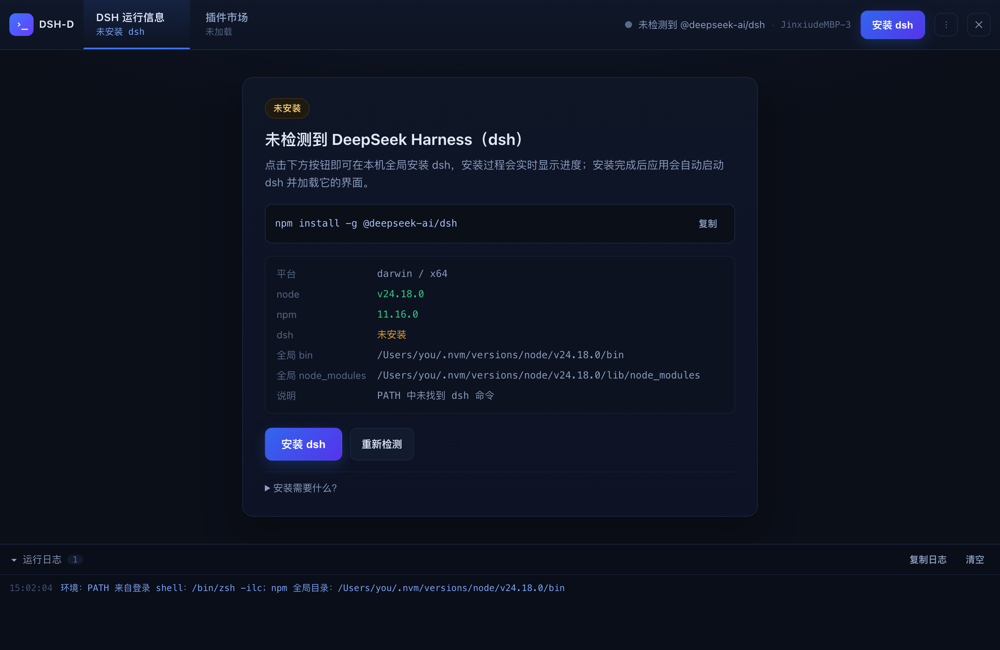
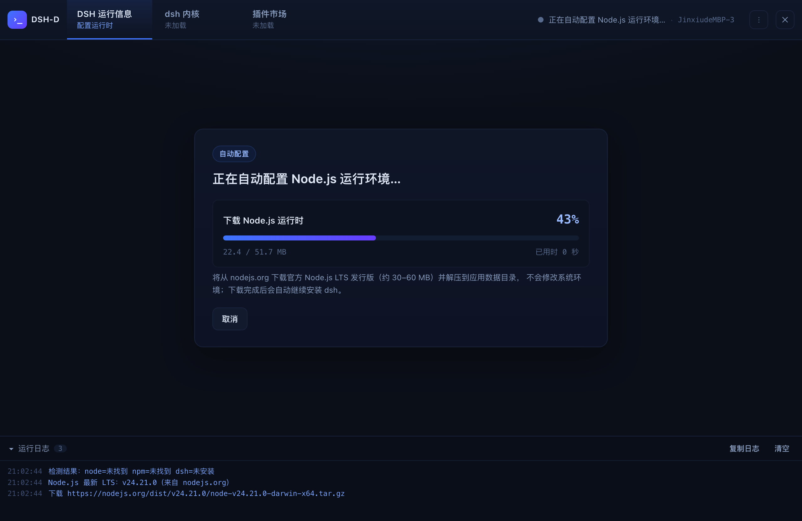
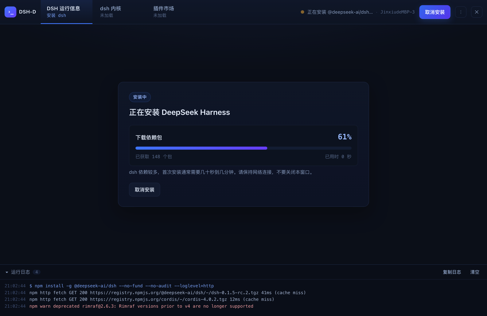
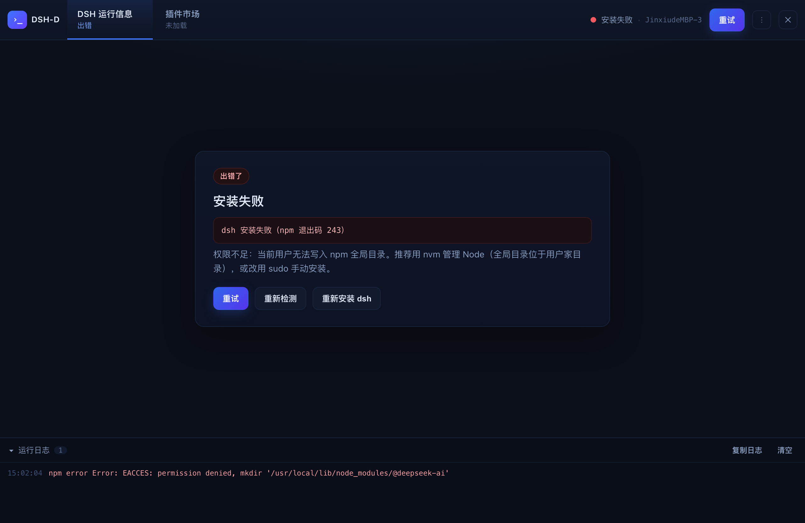
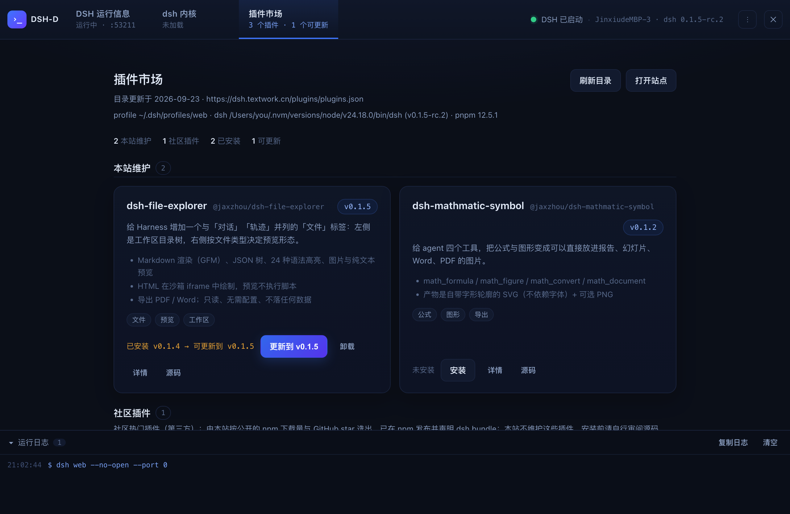
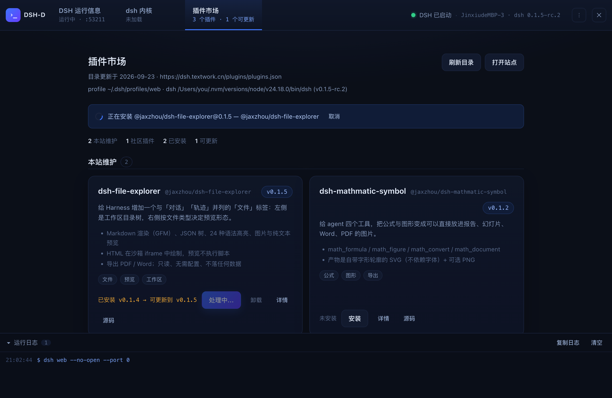
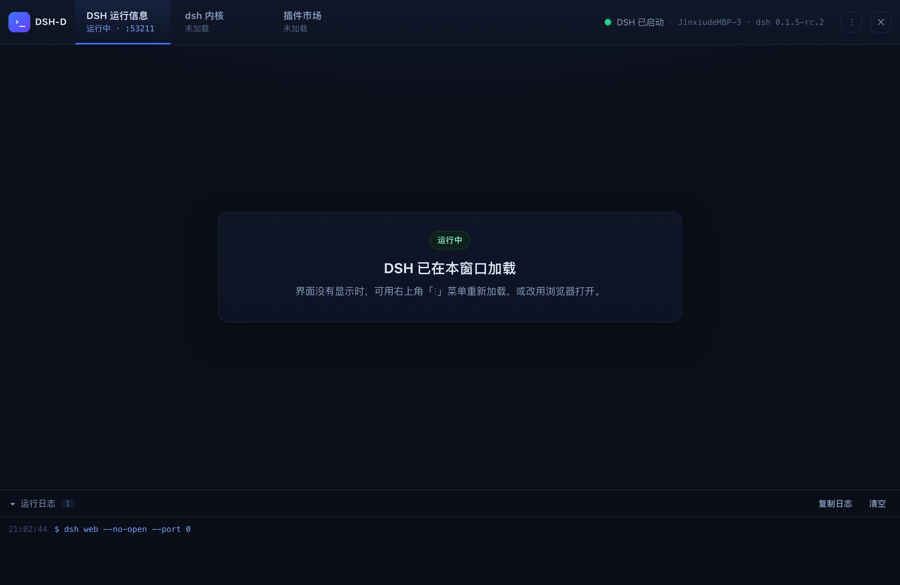
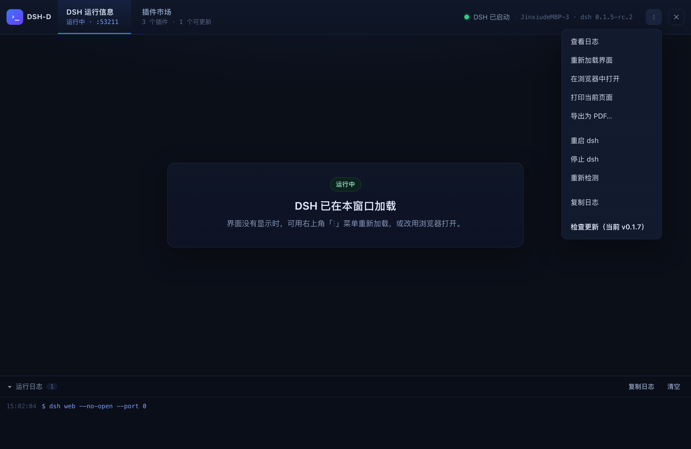

# DSH-D

一个 Electron 桌面外壳：**检测 → 安装 → 启动 → 加载** [DeepSeek Harness](https://github.com/deepseek-ai/deepseek-harness)（`dsh`）。

启动应用后：

0. **自动配置运行环境**：如果本机没有 Node.js、没有 npm，或 Node 低于 dsh 需要的 v22（dsh 依赖用到 `Promise.withResolvers`），应用会**自动下载官方 Node.js LTS 发行版**并解压到自己的数据目录，随后 dsh 也安装在同一个目录内——**无需管理员权限，也不改动系统已有环境**；下载与解压过程都有进度、可取消。**pnpm 与 Node/npm 一样纳入启动检查**：插件市场通过 `dsh plugin` 安装插件，而它本质是 pnpm 转发器，所以启动时若发现 pnpm 缺失会自动用当前 npm 装到同一运行时而无需管理员权限（失败不阻塞 dsh 运行，市场页会给出告警与一键重试）。
1. **检测**：自动解析登录 shell 环境（nvm / Homebrew / volta 装的 `node`、`npm`、`dsh` 在 GUI 应用里默认不可见，本项目会主动找回），并检测 `node`、`npm`、`dsh` 是否可用。
2. **安装提示**：若未检测到 `dsh`，界面展示安装卡片与将要执行的命令，点击「安装 dsh」即执行 `npm install -g @deepseek-ai/dsh`，并**实时显示进度**（阶段 + 百分比 + 已获取包数 + 耗时 + 完整日志，可取消）。
3. **启动**：安装完成后自动重新检测，并启动 `dsh web --no-open`。
4. **加载**：解析 dsh 打印的带鉴权 token 的地址，在窗口内嵌的 `WebContentsView` 中加载运行中的 dsh 界面。

### 打印

外壳自己拥有打印链路，**不依赖页面里是否存在打印按钮**：

| 入口 | 行为 |
| --- | --- |
| ⋮ 菜单 →「打印当前页面」 | 调起**系统打印面板**（`webContents.print({ silent: false })`） |
| 内嵌界面里按 Cmd/Ctrl+P | 同上（快捷键由外壳接管） |
| ⋮ 菜单 →「导出为 PDF…」 | `printToPDF` + 系统保存对话框，导出当前 dsh 页面 |

`scripts/print-probe.cjs` 是这件事的实测依据（Electron 43 / macOS）：

| 场景 | `window.print()` 结果 |
| --- | --- |
| 顶层页面（内嵌视图） | ✅ 打开系统打印面板（渲染进程被阻塞） |
| 同源 iframe（无 sandbox） | ✅ 打开系统打印面板 |
| `sandbox="allow-scripts"` / `+ allow-modals` / `+ allow-same-origin` | ❌ 调用立即返回，被 Chromium 忽略 |

也就是说：**页面顶层的打印可用；但任何 `sandbox=` 的 iframe 里的打印调用都会被浏览器拦掉**，外壳无法从外部代它调用（跨域 + 沙箱）。`@jaxzhou/dsh-file-explorer` 的 HTML 预览正是渲染在沙箱 iframe 中，所以它的打印要靠外壳入口或插件自带的「导出 PDF / 导出 Word」（页面内 Blob 导出，不经过打印对话框）。运行 `./node_modules/.bin/electron scripts/print-probe.cjs --no-sandbox --disable-gpu [--dialog]` 可复现上表（`--dialog` 会短暂打开真实的系统打印面板）。

### 完全离线的 Linux 版

常规 Linux 包在首次运行时会按需联网（缺 Node 时下载官方 LTS、缺插件时从 npm 安装）。离线版把这一切预先装进包里，**首次运行到启动 Harness 全程不需要网络**：

| 随包内容 | 说明 |
| --- | --- |
| `resources/vendor/node/` | Linux x64 Node 运行时 + npm + **pnpm** + **dsh**（含其全部依赖，含原生模块） |
| `resources/vendor/dsh-home/` | DSH_HOME 种子：`web` profile 里 **已装好 `@jaxzhou/dsh-file-explorer`** 并列入 bundles 层 |
| `resources/vendor/pnpm-store.tgz` | pnpm store，插件安装/更新在离线时也能走本地 |
| `resources/vendor/plugins/` | 插件 tarball，便于离线重装 |
| `resources/vendor/manifest.json` | 打包内容与版本（客户端据此显示"离线内置"） |

首次运行时应用会把种子 home 展开到用户数据目录（保留已有 sessions/凭据），把 pnpm store 解到同处，并把 `DSH_HOME` 指向它——`dsh` 与插件都从包内加载，不做任何下载；市场页的"运行信息"行会标出 `离线内置 dsh …`。

产物（`release-offline/`）：

| 文件 | 说明 |
| --- | --- |
| `DSH-D-Offline-<版本>-linux-x64.tar.gz` | 便携版（解压即用，约 260 MB） |
| `DSH-D-Offline-<版本>-linux-x64.AppImage` | 单文件版（chmod +x 直接运行） |

> 构建在 Linux 容器内完成（`scripts/build-offline-linux.sh`）——macOS 上跨装依赖树会挑到 darwin 二进制，而 dsh 的依赖里有原生模块（node-pty）。
> 两个可复跑的验证脚本：`scripts/verify-offline-linux.sh`（断网容器里验证 payload：版本可用、插件就位、`dsh web` 能起并服务 Web UI、客户端逻辑零下载）与 `scripts/verify-offline-app.sh`（把打包好的离线应用放进容器，在只保留 loopback 的命名空间里跑它自己的 `--self-test`）。

### Windows 上的进程与文件占用（插件 / 内核 / 重启）

Windows 不允许替换或删除**正被进程打开**的文件：dsh 的原生模块（`node-pty` 的 `*.node`）、它自己的安装目录、profile 里的插件目录都是如此。因此"装插件"和"换内核"都不是纯文件操作，而是**进程操作**：

| 操作 | 现在的顺序 |
| --- | --- |
| 插件安装 / 更新 / 卸载 | **停 dsh（确认进程已退出）** → `dsh plugin …`（pnpm 写 profile）→ 启动 dsh（读新的 bundle 层） |
| 内核更新 | **停 dsh** → `npm install -g @deepseek-ai/dsh@<版本>` → 重新检测 → 启动 dsh |
| 重启 dsh | 停（确认退出）→ 启动 |

具体做法：

- **`terminate()` 会等进程真的死掉**：Windows 上直接 `taskkill /pid <pid> /T /F` 结束**整棵树**——dsh 是通过 `.cmd` 垫片启动的，直接子进程是 `cmd.exe`、真正干活的是它下面的 `node.exe`，而 `taskkill` 不带 `/F` 对这种控制台进程必然失败（旧实现因此每次空等 6 秒，还在进程没死时就返回，于是插件安装/重启与正在退出的 dsh 抢文件）。现在强制结束之后仍然**等待 `exit` 事件**才返回，`stop()` 再留 350ms 让系统释放句柄。POSIX 上先 `SIGTERM`、超时后 `SIGKILL`，同样等到真正退出；实在杀不掉时如实上报 `exited: false`（不谎报"已停止"）。
- **互斥**：插件操作、内核更新、npm 安装、pnpm 自举、重启、停止共享一个"忙碌"守卫。任一操作进行中，其它操作会被直接拒绝并说明原因（`正在安装/更新插件，请稍候再试`），避免两个 pnpm/npm 同时改写同一个 profile 或安装目录。
- **锁冲突自动重试**：pnpm/npm 报 `EBUSY`/`EPERM`/`resource busy or locked` 时，等待 1.5–2 秒**重试一次**——刚退出的进程、正在扫描新写入文件的杀软都会造成短暂占用。
- **退出时等待子进程**：`dispose()` 会等 npm/pnpm 子进程真正结束（上限 8 秒，避免卡住退出）再关闭，防止残留进程一边写文件一边让下次启动撞上占用。
- **单实例**：应用本身有单实例锁，第二次启动只会聚焦已有窗口，不会起第二套 dsh 抢同一个 `DSH_HOME`。
- **失败不留半套状态**：插件操作失败时会把原来那套 dsh 重新启动（不会停在"已停止"）；内核更新失败会重新检测并启动仍然可用的旧版本，并在界面上给出权限提示。

> 已知限制：应用被**强杀**（任务管理器结束进程、断电）时 Windows 上可能留下一个 dsh 子进程。它不会占端口（端口由系统分配），但会占用同一个 profile —— 重启应用后在插件市场重试一次即可（每次插件操作都会重新停启）。POSIX 侧只向直接子进程发信号，dsh 自己再派生的孙进程不会被单独清理。

### 顶部大 tab

三个大 tab 与品牌、状态、操作同在**顶栏一行内**（不另起一行）；内嵌的 dsh 界面从顶栏下方开始。

| tab | 内容 |
| --- | --- |
| **DSH 运行信息** | 运行中的 dsh Web 界面（内嵌 `WebContentsView`）；未就绪时显示检测/安装/启动各阶段面板 |
| **dsh 内核** | 检测将要启动的 dsh 版本，并从官方 npm / GitHub 已发布版本里安装、切换或回退（详见下节） |
| **插件市场** | 外壳自带的插件市场（独立于 dsh，不是 dsh 插件）：读取 `dsh.textwork.cn` 的目录，按 **本站维护 / 社区插件** 两组展示，标注版本、本地已安装版本与可更新项，可一键 **安装 / 更新 / 卸载**；变更后自动重启 dsh 并刷新 DSH tab 的 Web 界面 |

插件市场的数据来源是站点的唯一数据源 **<https://dsh.textwork.cn/plugins/plugins.json>**（自身段 `plugins` + 社区段 `community`，含 npm 同步的版本/许可/仓库等字段；`plugins/index.json` 作为旧格式回退保留）。仓库内 `site/plugins/index.json` 是站点发布内容的镜像，由站点侧工具生成，不是手工编辑的源。默认管理 dsh 的 `web` profile。可用 `npm run test:network` 校验线上目录可达、两组齐全、条目合法，并对比目录版本与 npm 最新版是否漂移。

工具栏只保留当前阶段的主操作（安装 / 取消 / 停止 / 重试），**重新加载、查看日志、浏览器打开、重启/停止 dsh、重新检测等调试与维护操作都收在右上角的「⋮」菜单里**；状态区显示当前状态 + 机器名 + dsh 版本（端口仅在内部使用，不占用界面）。退出应用时会一并结束 dsh 子进程。

> 现成安装包发布在 **<https://dsh.textwork.cn>**（Windows / macOS / Linux），
> 校验清单：<https://dsh.textwork.cn/download/SHA256SUMS>

### 外壳自更新

桌面壳**自己的更新**与插件市场是两条独立链路：插件更新的是 dsh 里的插件，自更新换掉的是外壳本身。检查方式、状态与入口都不共用。

- **一份发布清单**：`https://dsh.textwork.cn/download/latest.json` 由 `scripts/publish-update-manifest.mjs` 随产物一起生成，列出最新版本、说明与**各平台包的文件名 / 大小 / SHA-256**（Windows `nsis`+`zip`、macOS `zip`、Linux `appimage`/`deb`/`tar.gz`，以及离线版的 `linux-offline` 包）。
- **不常驻**：启动后 8 秒查一次（静默，失败只记日志），之后每 6 小时一次；没有后台守护进程，定时器 `unref` 后不影响退出。也可以在右上角 **⋮ 菜单 →「检查更新」** 手动触发。
- **发现更新才出现**：顶栏下方弹出更新条（含新版本号、当前版本、包体大小），⋮ 按钮上加一个小圆点；用户可以「更新」或「稍后」（稍后只对当前这个版本静默，菜单里的入口仍然保留）。
- **下载即校验**：点击「更新」后显示百分比进度，落盘后按清单里的 SHA-256 复核，**不一致就删除文件并报错**，不会安装来历不明的包。
- **替换后自动重启**：外壳先退出（顺带结束 dsh），再由辅助程序完成替换并重新启动：

| 平台 | 安装方式 | 说明 |
| --- | --- | --- |
| Windows | NSIS 安装包 `DSH-D-Setup-<版本>.exe /S --force-run` | 静默安装并在完成后拉起新版本 |
| macOS | 辅助脚本 `ditto -x -k` 解压后替换 `.app` | 若应用所在目录不可写（例如非管理员装的 `/Applications`），则转为**人工指引**并打开下载位置，不会尝试半套替换 |
| Linux（AppImage） | 辅助脚本 `mv` 覆盖 `$APPIMAGE` 并 `chmod +x` | 仅当确实以 AppImage 方式运行时 |
| Linux（deb / tar.gz） | 人工安装 | 交给包管理器，外壳只负责下载、校验并打开所在目录 |
| 开发模式 | 不自动替换 | `app.isPackaged === false` 时只提示 |

辅助脚本都会先 `kill -0 <pid>` 等待外壳退出，再去动文件，因此不会替换正在运行的程序；脚本在替换完成后重新启动外壳（dsh 会随之重新拉起）。

离线版（`DSH-D Offline`）用自己的 `linux-offline` 产物：清单里若没有对应条目就回到普通的 Linux 包或人工指引；**断网时检查只会留下一条可读日志，不会阻塞启动**（`DSH_D_UPDATE_CHECK=0` 可完全关闭自动检查）。

### dsh 内核版本（检测 + 更新）

顶部第三个 tab「dsh 内核」管理的是 **Harness 本身**（`dsh`）的版本：外壳先把将要启动的那个 dsh 认出来，再让你把它换成官方发布的任意版本。

| 区域 | 内容 |
| --- | --- |
| 顶部信息行 | 当前 dsh 版本、可执行文件路径、是否外壳私有安装 / 离线内置、`DSH_HOME` |
| 两张头卡 | **最新发布版本**（npm `dist-tag latest`）与 **下一版本预览**（`next`），各带一键安装 |
| 版本列表 | 版本号 · 类型标签（正式版 / RC 候选版 / Alpha 内测版）· npm 标签（latest/next/alpha）· 是否 git 已发布 · 发布日期 · 与当前版本的新旧关系；每行可 **安装 / 重新安装 / 切换到此版本**（旧版本即降级），并可就地展开**中文发布说明**、跳转官方发布页 |
| 更新横幅 | 安装阶段 · 百分比进度 · 取消；完成后显示 `0.1.5-rc.3 → 0.1.7-rc.2 · dsh 已重启` |

**版本从哪来**（两个官方来源）：

| 来源 | 作用 |
| --- | --- |
| npm `registry.npmjs.org/@deepseek-ai/dsh` | 权威可安装清单：全部已发布版本、`dist-tags`、发布时间 |
| GitHub `deepseek-ai/deepseek-harness` releases/tags | 官方发布说明（自动截取**中文段落**）、git 标签、发布页链接 |

只出现在 git 标签里、npm 上还没有的版本也会列出来，但标注「未发布到 npm」并禁用安装按钮——安装永远走 npm 官方包，不会去编译 git 源码。两个来源里 npm 是必需的，GitHub 只是补充：`api.github.com` 被墙或被限流时目录照常可用（界面上会说明"部分来源不可用"）。

**以发布版本 / RC 为主要版本**：dsh 目前只发布 RC 与 Alpha（它的 `latest` 本身就指向 `0.1.7-rc.2`），所以默认列表 = **正式版 + RC** 为主线，Alpha 等预发布默认折叠，勾选「显示 Alpha 等预发布版本」才展开。推荐策略：

| 当前版本 | 提示 |
| --- | --- |
| 低于 `latest` | 可更新到 `latest`（列表里该行高亮为推荐） |
| 等于 / 高于 `latest` 但低于 `next` | 已跟上发布线，可试用 `next` |
| ≥ `next` | 视为最新 |

**更新是怎么做的**：用**检测 dsh 时用的那个 npm**（同一套登录 shell 环境解析）执行 `npm install -g @deepseek-ai/dsh@<版本>`，所以外壳自动配置的私有运行时与系统 nvm/Homebrew 安装都能更新；安装前先 `SIGTERM` 停掉正在跑的 dsh（npm 要替换它正在执行的文件），装完重新检测并启动，界面随之内嵌刷新。npm 全局目录不可写时，界面上会给出「改用外壳自动配置的运行时」的提示，并把原来那个版本重新拉起来继续用，不会留下半装状态。版本号在进入命令行前经过白名单正则，远端目录内容无法变成可执行命令。

**离线自包含版**内置 dsh，内核由离线包提供：内核 tab 会显示停用说明并禁用安装按钮（保持"首次运行到启动全程不联网"的承诺），常规版才能这样更新。

还没装 dsh 时也可以先挑版本：DSH 运行信息页的「按版本安装…」直接跳到内核 tab，选中的版本就是首次安装的版本。

> 复跑这套机制的实网验证：`npm run test:kernel`（用临时 prefix 真实安装两个 RC 版本并执行二进制核对版本，**不会动你本机的全局 dsh**）、`npm run test:network`（校验线上目录可达、dist-tags 合法、git 发布说明可解析、以及本机 dsh 版本能被这套规则识别）。

## 快速开始

```bash
npm install          # 安装 electron 与 electron-builder
npm start            # 开发运行
```

打包成可直接在桌面运行的安装包（**可在 macOS 上交叉构建 Windows 客户端，无需 Wine**）：

```bash
npm run dist         # 当前平台，输出到 release/
npm run dist:mac     # macOS: dmg + zip（未签名，本机可直接运行）
npm run dist:win     # Windows: NSIS 安装包 + 免安装 zip（在 macOS/Linux 上同样可用）
npm run dist:linux   # Linux: AppImage + deb + tar.gz（在 macOS 上交叉构建同样可用）
npm run pack         # 只产出当前平台的应用目录（最快，双击即可运行）

# 完全离线的 Linux 版（自包含 Node/pnpm/dsh/插件，见下文）
scripts/build-offline-linux.sh
npx electron-builder --config electron-builder.offline.yml --linux
```

网络受限时（GitHub Releases 不可达）交叉构建 Windows 的完整命令：

```bash
ELECTRON_MIRROR=https://registry.npmmirror.com/-/binary/electron/ \
ELECTRON_BUILDER_BINARIES_MIRROR=https://registry.npmmirror.com/-/binary/electron-builder-binaries/ \
npx electron-builder --win
```

产物：

| 文件 | 说明 |
| --- | --- |
| `release/mac/DSH-D.app` | macOS 应用包，双击运行 |
| `release/DSH-D-0.1.2-mac.zip` | macOS 压缩分发版（解压即用） |
| `release/DSH-D-0.1.2.dmg` | macOS 拖拽安装镜像 |
| `release/DSH-D-Setup-0.1.2.exe` | Windows 安装包（NSIS，可选安装目录、创建桌面快捷方式） |
| `release/DSH-D-0.1.2-win.zip` | Windows 免安装压缩版（解压后运行 `DSH-D.exe`） |
| `release/win-unpacked/` | Windows 免安装目录（打包中间产物，可直接运行） |
| `release/DSH-D-0.1.2.AppImage` | Linux 免安装单文件（chmod +x 后直接运行） |
| `release/dsh-d_0.1.2_amd64.deb` | Debian/Ubuntu 安装包（自动创建 `/usr/bin/dsh-d` 与桌面项） |
| `release/dsh-d-0.1.2.tar.gz` | Linux 免安装压缩版 |

> **DMG 需要联网下载工具**：electron-builder 的 `dmg` 目标会从 GitHub Releases 下载 `dmgbuild` 工具包，无法访问 GitHub 时会失败（`.app` 与 `.zip` 已在失败前生成，可直接使用）。离线替代方案：
> ```bash
> npm run pack && ./scripts/make-dmg.sh
> ```
>
> 应用图标已预先构建好三平台所需格式——`assets/icon.icns`（macOS）、`assets/icon.ico`（Windows）、`assets/icons/*.png`（Linux 尺寸集），打包因此不再需要从 GitHub 下载 electron-builder 的图标工具；修改 `assets/icon.png` 后重新生成即可：`node scripts/make-icons.mjs`。
>
> **Linux 的 deb 与 macOS 的 GNU tar**：electron-builder 用 fpm 打包 deb，而 fpm 会用 GNU tar 的 `--owner=0 --group=0` 归档，macOS 自带的 bsdtar 不支持这两个选项（`Option --owner=0 is not supported`），deb 会直接失败。`npm run dist:linux` 在 macOS 上检测不到 GNU tar 时会自动把 `scripts/gtar-shim` 放到 PATH 最前——这是一个把 GNU 选项翻译成 bsdtar 等价的薄垫片（仅用于打包，不进入产物）。装了 `brew install gnu-tar` 后就不再需要它。
>
> **Apple Silicon**：默认构建当前架构；交叉构建用 `npx electron-builder --mac --arm64`。`identity: null` 表示不签名，Intel 机器可直接运行；在 M 系列机器上分发时建议至少做临时签名 `codesign --force --deep --sign - "release/mac/DSH-D.app"`，或配置 Apple Developer 证书并公证。
>
> macOS 构建为未签名版本（`electron-builder.yml` 中 `mac.identity: null`）。首次打开若被 Gatekeeper 拦截，右键「打开」或在「系统设置 → 隐私与安全性」中允许即可。要分发给他人，请配置 Apple Developer 证书与公证。
>
> **Electron 版本**：固定为 `^43`。Electron 44 起已移除 macOS 12（Monterey）支持，43 是最后一个可在 Monterey 上运行的版本；若你的机器是 macOS 13+ 或 Windows/Linux，可自行升级到最新版。
>
> 如果 `npm install` 卡在下载 Electron 二进制（网络无法访问 GitHub Releases），可使用镜像：
> ```bash
> ELECTRON_MIRROR=https://registry.npmmirror.com/-/binary/electron/ npm install
> ```
> npm 11.16+ 若提示安装脚本未授权（Electron 二进制未下载），执行 `npm approve-scripts electron electron-winstaller` 后重新 `npm install`，或手动补跑：`cd node_modules/electron && node install.js`。

## 界面预览

工具栏只放当前阶段的主操作，调试类操作统一收进右上角「⋮」菜单：

| 检测中 | 未安装（安装提示） |
| --- | --- |
|  |  |

| 自动配置 Node.js 运行时 | 安装 dsh（进度 + 实时日志） |
| --- | --- |
|  |  |

| 运行中出错 | 插件市场 |
| --- | --- |
|  |  |

插件市场支持安装/更新，过程有进度与取消，完成后自动重启 dsh 并刷新 DSH 界面：



运行中：顶部工具栏显示 `DSH 已启动 · 机器名 · dsh 版本`，右侧「⋮」菜单包含「返回 DSH 界面 / 查看日志、重新加载界面、在浏览器中打开、重启 dsh、停止 dsh、重新检测、复制日志」，工具栏下方即内嵌的运行中 dsh 界面（选「查看日志」会临时隐藏界面，方便查看日志）。



「⋮」菜单（运行中）：查看日志 / 重新加载界面 / 在浏览器中打开 / 重启 dsh / 停止 dsh / 重新检测 / 复制日志。



> 预览图由 `npm run capture-ui` 生成（`--capture-ui`，用合成状态渲染各阶段后截图，不会启动 dsh）。

## 脚本

| 命令 | 作用 |
| --- | --- |
| `npm start` | 启动桌面应用 |
| `npm run dev` | 启动并打开开发者工具 |
| `npm test` / `npm run verify` | 纯 Node 逻辑验证（检测、进度模型、安装流程、服务生命周期、状态机端到端） |
| `npm run self-test` | Electron 运行时冒烟测试：窗口、preload 桥、界面、内嵌视图、工具栏、IPC；**不会启动 dsh** |
| `scripts/print-probe.cjs` | 打印链路实测：打印机/printToPDF/window.print()/沙箱 iframe/外壳 printPage（`--dialog` 会打开系统面板） |
| `npm run test:kernel` | dsh 内核更新实网验证：用临时 prefix 真实安装两个 RC 版本、执行二进制核对版本（不影响本机全局 dsh） |
| `npm run test:update` | 自更新线上验证：真实下载本机对应的包、比对 SHA-256、解开确认包内版本号与 appId，并打印会执行的替换计划（不真的替换） |
| `scripts/publish-update-manifest.mjs` | 生成自更新发布清单 `latest.json`（版本 + 各平台文件 + 大小 + SHA-256） |
| `scripts/verify-update-apply.sh` | 替换演练：在临时目录里用**本地构建的包**真实执行辅助脚本（mac 占位 `.app` → 0.1.8、AppImage 覆盖并保持可执行），验证"退出后替换"这一环 |
| `npm run test:network` | 实网验证：真实下载 Node.js LTS、确认 npm 全局目录落在托管目录内、真实安装一次 dsh，以及校验线上插件目录（两组齐全 / 条目合法 / 与 npm 版本一致） |
| `npm run diagnose` | 运行时配置诊断：模拟一台没有 Node 的机器跑完整流程，逐条打印 node/npm 检查结果（排查环境问题用） |
| `scripts/build-offline-linux.sh` | 构建离线自包含 payload（在 Linux 容器内装 Node/pnpm/dsh/插件） |
| `scripts/verify-offline-linux.sh` | 断网容器验证 payload（含用 payload 的 node 跑客户端离线逻辑） |
| `scripts/verify-offline-app.sh` | 在断网容器里运行**打包后的**离线应用自检（xvfb）；容器里每次都会 apt 安装 Electron 运行时依赖，网络慢时可先用 `docker commit` 预热一个镜像并用 `NODE_IMAGE=<镜像>` 复用 |
| `npm run capture-ui` | 把各阶段界面渲染成 `ui-preview/*.png`（含打开的 ⋮ 菜单） |
| `npm run pack` / `npm run dist` | 打包桌面应用 |

## 目录结构

```
src/main/
  main.js          Electron 主进程：窗口、IPC、内嵌 dsh 界面视图、退出时清理
  controller.js    状态机：checking → missing-dsh → installing → starting → running
  shell-env.js     登录 shell 环境解析（找回 GUI 应用缺失的 PATH）
  dsh-detect.js    node / npm / dsh 检测与版本解析
  dsh-install.js   npm 全局安装，流式输出与失败诊断
  progress.js      npm 输出 → 进度模型
  dsh-server.js    dsh web 进程监管 + 带 token 地址解析
  plugin-market.js 插件市场：目录抓取/校验、已装插件扫描、pnpm 自举、安装命令
  kernel.js        dsh 内核目录：npm/git 元数据解析、版本分类（正式/RC/Alpha）、推荐与安装参数（纯逻辑）
  updater.js       自更新：发布清单解析/校验、平台包选择、替换方案与辅助脚本（纯逻辑）
  update-manager.js 自更新状态机：检查/下载/校验/计划，定期检查与并发保护（纯逻辑）
  process-tree.js  子进程终止与行缓冲
  preload.js       contextBridge 安全桥（渲染进程仅能调用白名单方法）
src/renderer/      界面：顶部大 tab（DSH 运行信息 / 插件市场）+ 阶段面板 + 日志面板
site/plugins/      站点侧内容（插件市场目录 index.json，随 dsh.textwork.cn 发布）
test/              验证脚本与 fixture（伪 npm、伪 dsh）
```

## 设计要点

- **GUI 应用的 PATH 问题**：从 Finder/Dock 启动的应用不继承登录 shell 环境。`shell-env.js` 通过 `<shell> -ilc 'printf %s "$PATH"'` 取回真实 PATH，再补充 nvm/Homebrew/volta/pnpm 等常见目录与 `npm prefix -g` 推出的全局 bin 目录。
- **进度从哪来**：`npm install -g` 在非 TTY 下不打印进度条，因此以 `--loglevel=http` 运行，按 `http fetch` 行数渐进推进（渐近曲线，上限 78%），再用 `reify` / `added N packages` 行收尾到 100%。百分比单调递增，不会倒退。
- **为什么要等一行日志**：`dsh web` 打印的地址带有本次进程的 token（`?token=…`，用于换取浏览器 cookie）。只有等待 `dsh web: <url>` 这一行，才能把可用的界面地址交给内嵌视图；因此用 `--port 0` 让系统分配空闲端口，避免端口占用类失败。
- **进程生命周期**：安装与 dsh 服务都是子进程，退出应用时先 `SIGTERM`、超时后 `SIGKILL`（Windows 用 `taskkill /T`），避免残留进程占住端口；`dispose()` 是异步的，所以首个 `before-quit` 会被延后到清理完成。
- **重启竞态**：旧实例的退出事件不会覆盖新实例的状态（控制器只接受"当前实例"的事件）。
- **运行环境自举**：dsh 的依赖用到 `Promise.withResolvers`（Node 22+），所以"没有 Node"也包括"Node 太旧"。缺失时下载官方发行版到 `<userData>/runtime/node-<版本>-<平台>-<架构>`，校验 `node --version` 可用后才交给后续流程；已下载的安装包与已解压的运行时都会复用，重试不会重复下载。
- **posix 上 npm 依赖 PATH 找到 node**：`bin/npm` 是指向 `npm-cli.js` 的符号链接，该脚本 shebang 为 `#!/usr/bin/env node`——因此执行 npm 需要 PATH 里先有 node。校验运行时（`verifyManagedRuntime`）会强制把托管 bin 目录置于 PATH 最前，而不是沿用调用方环境；否则在"本来就没有 node"的机器上，node 能装好但 npm 一定失败，从而陷入反复重配的死循环。
- **坏运行时不会被困在循环里**：只检查文件是否存在是不够的（半解压的运行时 node 能跑、npm 不能），复用前必须真实执行 node 与 npm；校验失败就删除目录重新配置，并在界面上说明是 node 还是 npm 失败、具体报错是什么。
- **为什么必须锁定 npm 的 prefix**：npm 的全局目录来自启动环境——父级 `npm run` 会导出 `npm_config_global_prefix`，用户 `~/.npmrc` 也可能写了 `prefix`，两者都会让 `npm install -g` 落到需要管理员权限的系统目录。因此托管运行时会把 `npm_config_prefix` 与 `npm_config_cache` 钉在托管目录内（registry/代理等其余配置保持不变），这也是实网验证里专门校验的一项。
- **插件装到"实际在跑的 dsh"上**：dsh 的 home 由 `$DSH_HOME`（支持 `~` 展开）或 `os.homedir()/.dsh` 决定，而 `os.homedir()` 在 Windows 读的是 `USERPROFILE`/`HOMEDRIVE`+`HOMEPATH`。市场因此**按传给 dsh 的那个环境**解析 home 与 `profiles/<profile>`（而不是想当然用 `~/.dsh`），并且始终用检测到的那个 dsh 执行命令——这样当 dsh 是 DSH-D 私有安装的（Windows 上常见，`<userData>/runtime/node-*/dsh.cmd`）、或机器把 `DSH_HOME` 指到别处时，读取的已装版本与安装目标都仍然正确。市场页顶部始终显示 `profile 目录 · dsh 路径(版本) · pnpm 状态`，profile 缺失时会列出该 home 下实际存在的 profile。
- **原生视图与壳层 UI 的层级**：内嵌的 dsh 界面是原生 `WebContentsView`，绘制在渲染层**之上**；因此下拉菜单若延伸到顶栏以下就会被它盖住（表现为"点了没反应"）。菜单展开期间会临时隐藏该视图、关闭后恢复，并且主进程在收到显示/隐藏请求时会按"当前 tab + 阶段"重新判断，避免市场 tab 上误显示视图。
- **插件市场为什么这样工作**：市场是外壳自身的能力（不是 dsh 插件）；它管理的是 **dsh 插件**，因为只有装进 dsh profile 的插件才会影响 Harness 本身。`dsh plugin` 本质是 pnpm 转发器——在 profile 目录里 `pnpm add`，随后把 `dsh.profile.bundles` 与已安装状态对齐，而 **bundle 只在启动时读取**，所以安装/更新成功后必须重启 dsh，这次重启同时也是"刷新 DSH tab 里 dsh Web"的动作。已安装的版本来自 `<profile>/node_modules/<pkg>/package.json`，`link:`/`file:` 等本地依赖会被标注出来。
- **外部输入不直接进命令行**：目录是远端数据，包名与版本都要先通过白名单正则（`@scope/name`、semver/dist-tag）才会拼进 `dsh plugin … add <pkg>@<ver>`；解析时也会丢弃非法条目，避免把远端内容变成可执行的命令。
- **pnpm 缺失时自动补**：`dsh plugin` 依赖 pnpm，而自动配置的托管运行时只有 npm，所以市场在安装前会检测 pnpm，缺失时用当前 npm 装到同一运行时而无需管理员权限。
- **Windows 上必须按 PATHEXT 解析**：Node 的 Windows 压缩包里**同时有 `npm`（给 git-bash 用的 POSIX 包装脚本）和 `npm.cmd`**，npm 全局安装同样会写出 `dsh`、`dsh.cmd`、`dsh.ps1`。cmd.exe 只按 PATHEXT 查找，无扩展名文件根本不能执行，所以候选名解析必须排除裸名字——否则会拿到 `.cmd` 旁边的 sh 包装，导致"npm/dsh 明明装好了却检测失败"，进而反复重配运行时。
- **Windows 上的 `.cmd`**：npm 与 dsh 在 Windows 上都是 `.cmd` 垫片，而 Node 18.20+/20.12+ 起不允许无 shell 直接 spawn `.cmd`/`.bat`，因此探测与启动都显式走 `cmd.exe`，并对 `C:\Program Files\...` 这类含空格的路径加引号（`shellCommandFor`）。
- **安全边界**：渲染进程 `sandbox` + `contextIsolation`，无 Node 集成，仅暴露白名单 IPC；dsh 界面同样是沙箱化视图，外链一律交给系统浏览器；界面有 CSP。

## 环境变量

| 变量 | 说明 |
| --- | --- |
| `DSH_D_PORT` | 固定 dsh web 端口（默认 `0`，由系统分配空闲端口） |
| `DSH_D_USER_DATA` | 覆盖 Electron 用户数据目录（便携 / 测试用），托管运行时位于其下的 `runtime/` |
| `DSH_D_NODE_MIRROR` | Node.js 发行版镜像（如 `https://registry.npmmirror.com/-/binary/node`），自动配置运行时时优先使用 |
| `DSH_D_NODE_VERSION` | 固定要安装的 Node.js 版本（如 `v24.21.0`），默认取官方最新 LTS |
| `DSH_D_MARKET_URL` | 插件市场目录地址，默认 `https://dsh.textwork.cn/plugins/plugins.json` |
| `DSH_D_VENDOR_DIR` | 离线 payload 目录（离线版自动从应用资源目录发现，一般无需设置） |
| `DSH_D_PROFILE` | 插件安装到哪个 dsh profile，默认 `web`（与外壳启动的 profile 一致） |
| `DSH_D_UPDATE_CHECK` | 设为 `0`/`off` 关闭外壳自动检查更新（手动菜单仍然可用） |
| `DSH_D_UPDATE_INTERVAL_MIN` | 自动检查间隔（分钟），默认 `360`（6 小时） |
| `DSH_D_UPDATE_MANIFEST` | 自更新发布清单地址，默认 `https://dsh.textwork.cn/download/latest.json`（自测/灰度可用本地地址） |

## 已验证内容

`npm test`（397 项）覆盖：登录环境解析、检测、进度模型、`dsh web: <url>` 解析、安装成功/失败与提示、服务启停生命周期、状态机端到端（未安装 → 安装 → 启动 → 运行 → 重启 → 停止，使用 fixture 注入，不触碰真实 npm/dsh），**模拟 `win32` 的 Windows 代码路径**（`.cmd` 是否走 shell、含空格路径的引号处理、PATH 分号分隔、PATHEXT 解析、Windows 全局目录推断），**运行时自动配置**（发行版地址解析、LTS 选择、下载进度、真实 tar 解压、复用与取消、托管环境 prefix/cache 锁定、控制器"缺 Node → 自动配置 → 进入安装 dsh"流程与失败兜底），**插件市场**（新目录 schema：自身/社区分组、`name`/`package` 兼容、站点相对链接补全、社区 downloads/stars、semver 比较含预发布、包名/版本白名单、目录解析与非法条目丢弃、profile 已装插件读取与版本来源、目录与本地状态合并、pnpm 自举、安装参数构造、控制器"先停 dsh → dsh plugin → 再启动 dsh → 版本更新"与失败后恢复运行），**打印与 PDF 导出**（Cmd/Ctrl+P 判定、系统面板调用与回调、用户取消、页面不可用/抛错、PDF 落盘与取消保存、写入失败），**进程冲突防护**（`terminate()`：已退出短路、POSIX 礼貌结束并等待、超时升级 SIGKILL 且等到退出、杀不掉时如实上报 `exited:false`、Windows 走 `taskkill /T /F` 且**发完仍等 exit 事件**、`waitForExit` 语义；控制器顺序：内核更新 `start → stop → install → start`、插件 `stop → dsh plugin → start`、失败后重新启动原版本、锁冲突重试一次、插件/内核/重启/停止四向互斥、`dispose()` 等待安装子进程且卡住时限时返回；静态审计：controller/main/dsh-server/plugin-market **没有调用未定义的方法**，以及"内核更新必须走真实存在的 `stopServer`"这类回归护栏），**dsh 内核版本目录**（正式/RC/Alpha/其他预发布分类、非法版本与注入式版本号拒绝、git 标签 `dsh-v…` 解析、npm dist-tags 与发布时间解析、合并两个来源并标注「仅 git 未发布到 npm」、默认只列正式版+RC 且可展开预发布、推荐策略四态、行关系与推荐标记、安装参数白名单、npm 必需/git 可选的优雅降级、GitHub 限流错误），**内核更新流程**（加载目录与缓存复用、切换筛选不重复抓取、非法版本不触达 npm、更新成功后重启 dsh 且状态里的版本刷新、失败时给出权限提示并恢复旧版本运行、取消、离线自包含版锁定且不调用 npm、未安装 dsh 时按指定版本首次安装），**外壳自更新**（清单解析与非法输入拒绝、按平台/架构/离线变体选择包、版本比较含预发布、各平台替换方案与不可写目录转人工、辅助脚本等待进程退出、SHA-256 校验通过/不符/文件缺失、**本地 HTTP 端到端"检查 → 下载 → 校验 → 计划"**、已是最新、下载 404、未下载拒绝应用、并发检查只请求一次、定期检查与 dispose 后停止、断网优雅失败），以及**dsh 实际位置与 pnpm 依赖**（按环境解析 home：posix `HOME` / Windows `USERPROFILE`/`HOMEDRIVE+HOMEPATH`/`DSH_HOME` 含 `~` 展开、profile 缺失时列出实际存在的 profile、pnpm 纳入检测、启动时自动安装 pnpm 且失败不阻塞、私有安装识别、市场读数与安装使用同一 home）。

`npm run test:network`（35 项）在真实网络上验证：下载 Node.js LTS（约 52 MB）→ 解压校验 → `npm prefix -g` 落在托管目录 → 真实执行 `npm install -g @deepseek-ai/dsh` 并运行托管目录内的 dsh；校验线上插件目录与**自更新发布清单**（可解析、覆盖 win/mac/linux 与离线变体、每个包的直链 HEAD 大小与清单一致、不可达时优雅报错），并校验 **dsh 内核目录**（npm+git 两来源、dist-tags 合法、latest 可安装、git 发布说明可截取中文、安装命令指向官方包，以及与本机真实 dsh 版本交叉验证）。

`npm run test:kernel`（8 项）把内核更新真的跑一遍：用本机 npm 和临时 prefix 安装 `0.1.7-rc.2`（25.7s）→ 执行 `bin/dsh --version` 确认版本 → 再切到 `0.2.0-rc.2`（23.4s）→ 确认版本确实变化 → 用目录推荐逻辑复核（当前 0.1.7-rc.2 → 提示可试用 0.2.0-rc.2）。全程不触碰本机全局 dsh。

`npm run test:update`（14 项）在真实网络上跑完自更新的下载链路：取线上清单 → 为本机选包 → 下载（本次实测 126 MB / 96 秒）→ 比对清单里的 SHA-256 → 解开 `.app` 确认 `CFBundleShortVersionString`、`CFBundleIdentifier`，并确认 `app.asar` 里确实带着 `update-manager.js`/`updater.js` → 打印替换计划与辅助脚本。

`scripts/verify-update-apply.sh`（7 项）把"退出后替换"这一环真的跑一遍：写一个版本号为 `0.0.1-stub` 的占位 `.app`，用本机构建出的 `DSH-D-<版本>-mac.zip` 执行 mac 辅助脚本（`kill -0 999999` 代表外壳已退出），替换后版本变为 `0.1.8`、appId 正确、主程序可执行；AppImage 辅助脚本同样演练（内容替换 + 权限保持）。

`npm run self-test`（91 项）在真实 Electron 中验证：窗口与界面渲染、preload 桥、IPC 往返、剪贴板 API、主进程检测、`WebContentsView` 创建/尺寸/隐藏，工具栏（菜单可展开、不遮挡退出按钮、运行阶段无内联调试按钮、状态区显示机器名与 dsh 版本且不含端口），**顶部 tab 与插件市场**（两个大 tab、切换后阶段面板让位、内嵌视图在市场上隐藏、用本地 fixture 目录渲染卡片与本地已装列表、有更新时出现更新按钮、安装会调用 dsh plugin 并自动重启、切回 DSH tab 恢复），**菜单与打印入口**（菜单项含打印/导出 PDF）、**实际位置与 pnpm 告警**（市场显示 profile 目录与 dsh 路径、pnpm 不可用时给出告警与"自动配置 pnpm"入口、点击后触发配置且告警消失），**dsh 内核 tab**（离线/常规两种语义各断言一套：离线版断言按钮禁用与 IPC 拒绝、常规版断言二次确认与安装结果；注入 fixture 加载目录、切到内核 tab 后阶段面板与市场面板让位且内嵌视图隐藏、渲染 3 行版本与两张头卡、每行都有安装按钮、tab 副标题显示版本与"可更新"、安装需二次确认、确认后经 IPC 调用注入的 npm 并写入 kernelAction、发布说明可展开且只含中文段落、更新中显示 42% 进度与取消并禁用所有安装按钮、离线版显示停用说明并禁用按钮、未安装 dsh 时提供"按版本安装"入口、preload 内核接口 IPC 往返），**外壳自更新界面**（默认不显示更新条、菜单含"检查更新"入口、用合成快照渲染出更新条/版本与大小/进度百分比/重启并安装、更新条高度计入内嵌视图内边距、稍后收起、未下载时拒绝应用以免误重启，且自检期间不联网），以及**菜单与层级**（用真实鼠标输入点击 ⋮ 验证可命中/展开/收起，菜单展开时内嵌视图隐藏、关闭后恢复，市场 tab 不显示视图）、**分组与卸载**（自身/社区两个分组、分组计数、已安装项出现卸载按钮、卸载走 dsh plugin remove 并同样重启）。

> 在受限环境（容器、外层的进程沙箱、CI）中，Chromium 自身的沙箱可能无法初始化，此时可加 `--no-sandbox --disable-gpu` 运行自检：
> ```bash
> npx electron . --self-test --no-sandbox --disable-gpu
> ```
> 正常桌面环境直接 `npm run self-test` 即可。

## 许可

MIT
